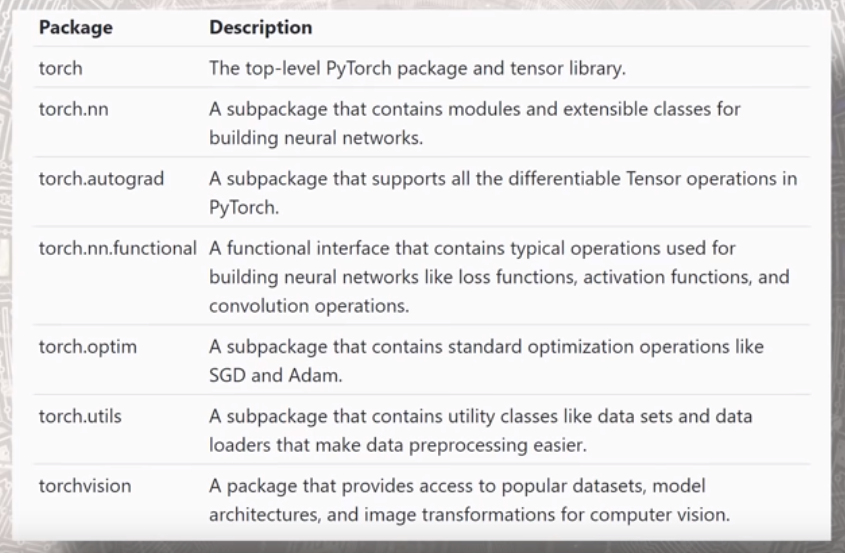

# Deep Learning with pyTorch

This text aims to explore the deep learning library pyTorch and document it's functionalities. The primary source which I've used is [this](https://www.youtube.com/playlist?list=PLZbbT5o_s2xrfNyHZsM6ufI0iZENK9xgG). 

## General Introduction of pyTorch

Tensors are the basic data structures used in pyTorch. They are basically n-dimensional arrays. It mirrors the ndarray functionality of the numpy package very closely. Also, it's easy to go back and forth between numpy and tensors. **GPU Support is available with tensors from pytorch**. 

The primary packages that we use with pyTorch with their corresponding descriptions are as follows:



### Advantages of using pyTorch over other frameworks

- In pyTorch you pretty much build most of the things from scratch. Therefore it kind of gives a lot of flexibility in terms of designing your very own neural networks in depth.
- It's NN functionalities aren't blackbox models. You could use a python debugger to understand and figure out where shit broke lose. It's error messages are intuitive in themselves in addition to having the debugger for helping you find the weak points.
- It uses dynamic neural networks and graphs are created on the fly making it one of the fastest implementations up to this day. Other models use static frameworks. 

You could view more about pyTorch, it's history, it's motivation and it's usefulness [here](https://deeplizard.com/learn/video/iTKbyFh-7GM).

## Installing and Verifying pyTorch

### Installing pyTorch

Open anconda command prompt and type in the following command

```python
   conda install pytorch torchvision cudatoolkit=10.1 -c pytorch
```

### Verification

Get the version of pytorch

```python
print(torch.__version__)
```

Check if cuda is available on your system (Depends on whether you've got a GPU on your system).
```python
print(torch.cuda.is_available())
```

Check the version of cuda downloaded on your system
```python
print(torch.version.cuda)
```

Verify the installed version of pyTorch
```python
conda list pytorch
```

## CUDA

Parallel processing is the one where a task is broken down into steps of small tasks and carried out at the same time. The resulting computations are then recombined to form the result of the original task.

GPUs or **Graphic Processing Units** are much better at such operations than a CPU. 

*The number of cores in a computing machine is how many subtasks can a task be divided into. A CPU generally has 4,8,16 cores whereas GPUs have potentially 1000s of cores.*

The tasks in a neural network are [embarrassingly parallel](https://en.wikipedia.org/wiki/Embarrassingly_parallel) and GPUs can accelerate these computations. For eg. consider a *kernel convolution operation*. The convolution results are independent and can happen on separate cores and can be overall combined at the end to give the necessary feature map. A CPU will perform every operation sequentially whereas several cores in GPU can perform this operation at the same time and collate the output eventually. Another example is a *dot product* which requires multiplying and summing. The multiplication can be split up across several cores and eventually the result could be summed together to obtain a dot product. 

It's easy to use GPUs in python. Just do the following

```python
tens = torch.tensor([1, 2, 3])
print(t)

t = t.cuda()
print(t)
```

In order to move the the tensor object from a cpu to a gpu, you've to simply use .cuda on the tensor and any operations on this tensor will be performed on the gpu. It's that simple. 

## Tensors

| Indices Needed | Computer Science | Mathematics |
| -------------- | ---------------- | ----------- |
| 0              | number           | scalar      |
| 1              | array            | vector      |
| 2              | 2d-array         | matrix      |
| n              | nd-array         | nd-tensor   |

A tensor is a more general representation of the concepts mentioned above. It is a data structure which encompasses all of the above types of data. 

A tensor has three fundamental attributes which are as follows:

### Rank

Rank of a tensor is the number of dimensions present within the tensor. If we have a 2 rank tensor, it means: 

- We've a 2d-array
- We've a matrix
- We've a 2d tensor

The rank of a tensor gives us the number of indices needed to refer to an element within the tensor.

### Axes

An axis of a tensor is a specific dimension of a tensor. A rank 2 tensor has 2-dimension or equivalently stated, it has got 2 axes. *Elements are said to exist or run along an axis*. 

Length of an axis is a constraint for this running of an element. If we are told that the length of it's first axis is 5 and that of the second axis is 6, we can say that we can index 5 positions along the first axis and 6 along the second. 

### Shape

The lengths of all the axes together correspond to the shape of a tensor. If we know the shape of a tensor, we know the axes and the rank as well. 

It's essential to understand how many axes and how long the axes are in a given tensor object. 

Reshaping a tensor in order to match the input output requirements of a neural network is one of the prime operations while building a neural network. It can be done as follows

```python
t = [[1,2],[2,3]]

t = torch.Tensor(t)

t.reshape(1,4)
```

It's important to remember that the number of elements in the tensor before and after reshaping must be the same. That's why when you reshape, you need to provide the numbers such that the product of lengths of all the axes in the operated and transformed tensors must be the same. 

### Example of a CNN Input Tensor

At the input stage:

[B, C, W, H]

B - Batch size (Generally NNs work with multiple images at once, how many $\to$ batchsize)

C - Number of color channels (1 for grayscale, 3 for RGB).

W - Pixel along the width of an image.

H - Pixel along the height of an image. 

After passing through a convolutional layer:

[B, FM, W$^{'}$,H$^{'}$ ]

B - Batch size

FM - Number of feature maps

W$^{'}$ - Pixel along the modified width of an image

H$^{'}$ - Pixel along the modified height of an image

## Tensors in pyTorch

A tensor object has by default the following three attributes:

A Datatype - Specifying the type of the class which an object belongs to.
```python
print(t.dtype)
```
A Device - Whether this object lives on the CPU or the GPU.
```python
print(t.device)
```
Layout - How the data is stored internally. Not necessarily important to know. Default is good enough.
```python
print(t.layout)
```

Torch tensors have a datatype and the operations in tensors require the datatype of two tensors to be of the same type. It is not possible to operate on tensors with different datatypes.

A torch tensor that lives in a gpu vs a torch tensor that lives in cpu has two different datatypes. And it's not possible to operate on them in this state. Either use the `.device('cuda')` to get the cpu tensor on the gpu or vice versa in order to make it happen.

### Creating tensor with existing data.

There are several ways of creating a tensor with existing data like numpy arrays. They are as follows:

```python
torch.Tensor(data)
torch.tensor(data)
torch.as_tensor(data)
torch.from_numpy(data)
```
data is a numpy array which is already defined in memory.

**Note:** The first one is different because it's made using the constructor in the Tensor class as if you provide it an integer data or whatever data, it'll interpret it as float data whereas others will infer the dtype of the data and accordingly create tensors with the dtype of the source data.  If you want to specifically instantiate a tensor with a particular dtype, you can use any one of the three later methods and do this:

```python
torch.tensor(data, dtype = torch.float64)
torch.as_tensor(data, dtype = torch.int32)
```

### Create tensor with predefined functions

Sometimes, we need to get an identity matrix or a matrix with all zeros or all ones etc. We can use the following functions for the same.

```python
torch.eye(n)
torch.zeros(m, n)    # For a tensor of all zeros
torch.ones(m, n)     # For a tensor of all ones
torch.rand(m, n)     # For a tensor of all random numbers
```

### Memory Sharing and Copying

The two methods `torch.tensor` and `torch.Tensor` work copy the information from a numpy array into a tensor and a separate memory space is made available to them. OTOH, the methods `torch.as_tensor` and `torch.from_numpy` only create references which causes changes to reflect in the destination if they've happened in the source. i.e. If you change the numpy array, then the tensors created from that array will be modified if they're created using `as_tensor` or `from_numpy` methods. 


### Flatten, Squeeze, Reshape & Concatenate

To check the size of a tensor you can use
```python
t.size()
t.shape
```

To check the rank of a tensor, you can use 
```python
len(t.size())
```

To find out the number of elements contained in a tensor, you can use 
```python
t.numel()
```
This operation is particularly useful when you want to check the suitability of a new dimension for your tensor. We always want the number of elements of the source and destination tensor to be equal in order to ensure that the reshaping operation happens without an error.

To reshape the tensor to a new dimension you can use
```python
t.reshape(m,n,p)
```
Note the caveat that source and destination should have same numel while reshaping.


**Squeezing and unsqueezing** operations allow us to expand or contract the rank of a tensor. Squeezing a tensor removes the dimensions or axes that have a length of one. Unsqueezing a tensor adds a dimension with a length of 1. 

```python
t.reshape([1, t.numel()]).squeeze()
```

A **Flatten** operation takes in a tensor and converts it to a 1-D tensor of number of elements in the tensor. Flattening a tensor means to remove all of it's dimensions except for 1.

```python
def flatten(t):
    t = t.reshape(1, -1)
    t = t.squeeze()
    return t
```

We can concatenate one tensor alongside another either rowwise or columnwise. This can be handy when you want to collate two tensors for some reason. We can do it as follows:
```python
t1 = torch.tensor(data1)
t2 = torch.tensor(data2)

# Rowwise concatenation
tcombined = torch.cat((t1, t2), dim = 0)

# Columnwise concatenation
tcombined = torch.cat((t1, t2), dim = 1)
```

A **Stacking** operation takes in a lot of tensors and adds a dimension to create a batch of tensors. eg. If we have 1000 images, we can make batches of size 64 which involve stacking 64 images together into one batch and that would be represented along an axis of the tensor. Here's how this could be achieved.

```python
# Stack 3 tensors together
tcomb = torch.stack((t1, t2, t3))
```

### Elementwise tensor operations

Two elements of a tensor are said to be corresponding if they both occupy the same position in their respective tensors. This restricts these operands to both be of the same shape. 

Elementwise operators are the ones which operate on corresponding elements in between two tensor operands.

However, this get's interesting when we have scalar values. When we operate a tensor with a scalar, it works (Well it shouldn't since the scalar is a rank 0 tensor and other tensors have non-zero rank so their shapes mismatch).

What happens under the hood is that the scalar value is broadcasted to be the same size/shape as the tensor on which it is operated and then the elementwise operation is carried out.

**In general, given two tensors, if the low rank tensor could be broadcasted to a high rank tensor, then the elementwise operation will happen no matter what, otherwise they won't and you'll get an error**.


Apart from the general arithmetic operations there are some other operations which you should be aware of and some of them are as follows. 

```python
# To check if elements of a tensor are greater than or equal to a number
t.ge(0)

# Less than or equal to a number
t.le(0)

# Greater than a number
t.gt(0)

# Less than a number
t.lt(0)

# Equal to a number
t.eq(0)

# Unary operators
# Square root
t.sqrt()

# Modulus function
t.abs()

# Negation
t.neg()

# Chained operations
t.sqrt().abs()
```

### Tensor Reduction Operations

They are the operations which reduce the number of elements of a tensor. There are a lot of useful tensor reduction operations which we will use commonly when dealing with tensors. Some of them are as follows:

```python
# Input is a nd tensor output is a 1D tensor with a single scalar value

# Sum all the elements of a tensor 
t.sum()

# Find the mean & standard deviation of all elements in the tensor
t.mean()
t.std()

# Find the product of all the elements in the tensor
t.prod()
```

We can reduce the tensor across a dimension in order to avoid getting one single scalar value as outputs. The meaning changes. For eg. if you mention dim = 0 in a mean operation on a 2D tensor, it will give a tensor of 1D values which will correspond to the means of all the columns in the tensor that you passed.

```python
t.sum(dim = 0)  # For a 3 row matrix, t[0] + t[1] + t[2]
t.sum(dim = 1)  # For a 3 row matrix, [t[0].sum, t[1].sum, t[2].sum()]
```

**argmax** is an important reduction operation which returns the index of the element which has the highest value in the tensor (Or a tensor depending along a user specific dimension if you provide one).

```python
t.argmax(dim = 1)
```

If you want to access a scalar element as the result of an operation, you could do the following
```python
t.sum().item()
```
Note that the output of `t.sum()` will be returning a tensor containing a scalar value but it might not be something that you want. You just want the scalar value. That time you can use `.item` to get the scalar value.

Also, if you operate along a row or column and get a 1-D tensor but want to operate on it in python, you could convert it to a list or into a numpy array and do the necessary processing.
```python
t.sum(axis = 1).tolist()
t.sum(axis = 1).numpy()
```

## Neural Networks in PyTorch

In the following example, we'll take the example of building a CNN in PyTorch and discuss how we can build one and the peripheral activities like image preparation and preprocessing etc. 

### Image Preparation

**Extract Transform Load Cycle**

This is the cycle which is a general representative procedure which is used to get data and organize it in order to further analyze it. Let's formally lay down what this cycle comprises of.

**Extract**: This phase corresponds to getting or sourcing data from single/multiple sources.

*Get the Fashion MNIST dataset from the source*

**Transform**: In this phase, the extracted data is processed and transformed into a structure which is suitable for analyzing the data further.

*Transform the images into tensors*

**Load**: Load the data into a suitable structure for querying and analysis.

*Put our data into objects to make them easily accessible*

```python
train_set = torchvision.datasets.FashionMNIST(
    root = './FashionMNIST',
    train = True,
    download = True,
    transform = transforms.Compose([
        transforms.ToTensor()
    ])
)

train_loader = torch.utils.data.DataLoader(train_set)
```

In the train_set object above, following are the arguments to initialize the object

- root: It specifies the directory substructure where to place the data that will be downloaded.
- train: Whether the data is train data or test data. We are loading trainset so, we specify train = True
- download: If data isn't available in the root directory, download else skip.

These above correspond to the **Extract** phase of the ETL cycle. 

- transform: The data needs to be in tensor data-structure for further processing. That's why we specified `toTensor` transformation in this argument.

This operation above is the **Transform** phase. 

Finally, we use the train_loader object which gives an organized object structure to iterate over our images to train the network we'll build to classify the images. This phase is **Load** phase of the cycle.

We can access images using the iterator feature of python over the train_set object in a one by one fashion using the following code:

```python
image, label = next(iter(train_set))
# Use a for loop to iterate over all the images.
```

If you want to build a batch of images, that's when the torch_loader object comes in handy. It's also a generator object which can be iterated over and it's very much similar to the code above.

```python
images, labels = next(iter(train_loader))
# Use a for loop to iterate over all batches of images.
```

While `image` is a 3D tensor (color channel by width by height), `images` is a 4D tensor (batch_size by color channels by width by height)

### Building a neural network in PyTorch

- Extend the nn.Module base class
- Define layers as class attributes
- Implement the forward method

To build an NN, we have to create a class which extends or inherits from the nn.Module class of pytorch. 

We will have to then define the layers which make up our network in the constructor so that when we initiate the network, these layers get instantiated to some weights and biases. 

We have to then manually override the forward method which carries out the forward propagation or feed forward function of the network which is used for prediction of labels given an image. Just as an example this is how a simple CNN network class can be coded

```python
import torch.nn as nn
class Network(nn.Module):
    def __init__(self):
        super().__init__()
        self.conv1 = nn.Conv2d(in_channels = 1, out_channels = 5, kernel_size = 5)
        self.conv2 = nn.Conv2d(in_channels= 5, out_channels = 12, kernel_size = 5)
        
        # Kernel convolution will reduce the pixels by 4 units each -> 28-4 = 24
        # Then first maxpooling will reduce the size by half -> 24 / 2 = 12
        # Next Kernel convolution reduces pixels by 4 -> 12 - 4 = 8
        # Next maxpool again reduces the size by half -> 8 / 2 = 4
        # Hence, linear layer input -> fmaps x w x h -> 12 x 4 x 4
        
        self.fc1 = nn.Linear(in_features = 12 * 4 * 4, out_features = 120)
        self.fc2 = nn.Linear(in_features = 120, out_features = 60)
        self.out = nn.Linear(in_features = 60, out_features = 10)
    
    def forward(self, t):
        return t
```


If you want to obtain the shape of a tensor changes as it passes through the layers of a convolutional layer, you can use the following formulae. Prefer to intuitively do it for small convolutional layers and operations so that you get a hang of the concept.

In case you're building a model like VGG-16 or ResNet or such complex architectures, these formulae come in handy as they give direct and simple formulae for calculation of the shape of the tensors.


More details could be found [here](https://deeplizard.com/learn/video/cin4YcGBh3Q).

**Parameters vs arguments vs hyperparameters**:

With respect to functions, parameters are the place holders and arguments are the values which the outer world provides to these place holders in order to do computations or instructions inside that function. 

`nn.Linear(in_features = 120, out_features = 60)`

In this function call, `in_features` and `out_features` are called parameters and 120, 60 are called arguments.

With respect to neural networks, there's a small modification to this general concept i.e. we have `parameters` and `hyperparameters`. The former are learned from the data and the latter are what we need to provide explicitly (or there are default values in place but it's not learned from data and needs to be explicitly specified).

**Learnable Parameters**:

Learnable parameters are the parameters whose values are learned during the training process. We start out with a set of arbitrary values and then update these values in an iterative fashion as the network learns.

When we say the network is learning, we specifically mean that the network is iteratively learning appropriate values for the parameters. Appropriate in the sense that they minimize the loss function. 

We can access the individual weights of a layer as follows:

```python
netw = Network()
print(netw.conv1.weight)
print(netw.fc1.bias)
```

### Linear/ Dense/ Fully Connected Layers

They're also called dense or fully connected layers and generally occupy the last few positions in a CNN architecture before the output layer. 

They have their own weights and biases which can be manually set or changed as and when needed. The weights are an instance of the `Parameter` object though which means when you're setting the weights, you need to ensure you convert that into necessary structure.

The forward pass of a linear layer is implemented by calling several functions. When you say `fc(input)`, it invokes a call to the `__call__` method which calls the `forward` method which calls the `F.linear()`(F being `torch.Functional` package) method which uses `matmul()` to compute the forward pass of the input to the output space.


To set the weights manually you may do it this way

```python
# Define a Linear Layer
fc1 = nn.Linear(in_features = 4, out_features = 3, bias = False)

# Define the weight tensor
weight_matrix = torch.tensor([
    [1,2,3,4],
    [2,3,4,5],
    [3,4,5,6]
], dtype=torch.float32)

# Set the weights of the linear layer to the weight tensor
fc1.weight = nn.Parameter(weight_matrix)
```

The result of the following operations given the layer is defined the way it is above will be same
```python
ip =  torch.tensor([1,2,3,4], dtype=torch.float32)

# Matrix multiplication operation of input tensor with weight tensor
print(weight_matrix.matmul(ip))

# Forward pass through the dense layer
print(fc1(ip))
```

### Implementing the forward pass

Forward pass or forward propogation is the process of mapping an input tensor to an output tensor. A neural network at the end of the day is nothing but a complex mathematical function.

The forward method can be implemented in the following way. Each layer is specified with the corresponding explanation in the code block below.

```python
# This is the method inside of the network class which we defined above. 
# Highlighting here for emphasis
def forward(self, t):
    # 1. Input layer
    t = t
    
    # 2. Convolution layer 1
    # A layer is the one which contains weights. Although relu and maxpool are sometimes
    # referred to as layers, they're simply operations as they don't contain weights.
    t = self.conv1(t)
    t = F.relu(t)
    t = F.max_pool2d(t, kernel_size = 2, stride = 2)
    
    # 3. Convolution layer 2
    t = self.conv2(t)
    t = F.relu(t)
    t = F.max_pool2d(t, kernel_size = 2, stride = 2)
    
    # Flattening the op of convolutional layer to feed it into a dense layer
    # The -1 stands for figure out yourself based on the input (Since batch size may be 
    # different, we keep it open)
    t = t.reshape(-1, 12 * 4 * 4)
    
    # 4. FC Hidden layer 1
    t = self.fc1(t)
    t = F.relu(t)
    
    # 5. FC Hidden layer 2
    t = self.fc2(t)
    t = F.relu(t)
    
    # 6. Output layer
    t = self.out(t)
    t = F.softmax(t)
    
    return t
```

We can use the forward method by directly passing the input tensor to the network or by calling the forward method explicitly using the `.forward()` object notation.

```python
model = Network()

# Call directly
pred = model(images)

# Call using the object notation for forward function
pred = model.forward(images)

# Get the classes for the prediction
pred = pred.argmax(dim = 1)
```

**If you only want to make predictions and not train the model, make sure to disable the gradient calculations to speed up your code execution. **

`torch.set_grad_enabled(False)`

Remember to turn it back on during the training phase by simply specifying the single parameter of the function to be True.

### Implementing Backpropagation

Backpropagation is how a neural network is trained to minimize the loss function and tune the parameters or the weights to do so.  We'll see how to implement it with code and mention what each line of code does explicitly. 

```python
# Note: Turn on the gradient enabled option to True before implementing backprop
# It is on by default, yet if you've disabled it for speedy computation somewhere, 
# Make sure to turn it back on. 
torch.set_grad_enabled(True)

# Calculation of loss

# Feed the images forward through the Neural Network
predictions = model(images)

# Calculate the loss after doing the forward pass
loss = F.cross_entropy(predictions, labels)
print(loss.item())
```

By this step we've passed a batch of images through the network in the forward direction and computed the loss. Now we need to find out the gradient of the loss function with respect to the weights and we can do it as follows. 

```python
# Computing the gradients
loss.backward()

# Updating the weights
from torch import optim

# Every optimizer needs to be passed in the parameters it's gonna update and the learning rate. For optimizers other than SGD, there can be other parameters as well which you can play with but these ones are key!

optimizer = optim.SGD(model.parameters(), lr = 0.01)

# Updating the weights
optimizer.step()
```

This is the backpropagation algorithm in action. All that's left is implementing this so that our network sees all the batches of images and that too multiple times. This is done in order to reduce the training loss and make our network learn to generalize well. This is how we implement the loop to backpropagate across multiple epochs to improve the model performance.

```python
# Defines the number of times the NN should look at the entire loop 
epochs = 5

for epch in range(epochs):
    
    total_loss = 0
    correct_predictions = 0
    for batch in train_loader:
        # Get the images and labels in a batchwise manner
        images, labels = batch
        
        # Forward pass
        predictions = model(images)
        
        # Loss calculation
        loss = F.cross_entropy(predictions, labels)
        
        # Accumulate the loss
        total_loss += loss.item()
        
        # Zero out the gradients.If you don't do this, gradients will get accumulated and  
        # the updates will happen incorrectly.
        optimizer.zero_grad()
        
        # Backpropagate the loss
        loss.backward()
        
        # Update the weights of the model
        optimizer.step()
        
        # Get number of correct predictions on the train set
        predictions = predictions.argmax(dim = 1)
        batch_correct = predictions.eq(labels).sum().item()
        correct_predictions += batch_correct
    
    print(f"Epoch: {epch}, Total Loss: {np.round(total_loss, 2)}, Correct Predictions: {correct_predictions}")
```

### Prediction and Validation

Now that we know how to train a neural network using pytorch, let's see how to validate our model and understand the predictions of our model. 

Prediction is simply implementing a forward pass of the trained neural network. However there's one important detail which shouldn't be overlooked. Since we're not training the model in this step, we can disable the gradient computation step in order to speed up our calculations and save memory as well.

`torch.set_grad_enabled` method is of our concern in this scenario. It could be set to False before prediction and True after prediction. That's what is done in the following codeblock.

```python
def get_predictions(model, loader):
    # Define an empty container
    all_preds = torch.tensor([], dtype = torch.int64)
    
    # Since we're not training, we turn off the gradient computation graph
    # This saves time and space both
    torch.set_grad_enabled(False)
    
    for batch in loader:
        # Get a batch of images
        images, labels = batch
        
        # Predictions from the images (probabilities)
        preds = model(images)
        
        # Get the class labels from predictions
        predictions = preds.argmax(dim = 1)
        
        # Combine the batch's predictions into a single tensor all_preds
        all_preds = torch.cat((all_preds, predictions))
    
    # Set the gradient computation back on which you'd turned off earlier
    torch.set_grad_enabled(True)
    
    return all_preds
```

### Hyperparameter Tuning  using Tensorboard

We can perform hyperparameter tuning using the following methods and visualize it in tensorboard. Then we can pick the best hyperparameters for building our network and use it.

**Creating a grid of values**
- Individually define lists for all the parameters which you wanna use to build the network architecture.

- Use Cartesian product to create an assortment of all those pairs together.

```python
params = dict(
LR_values = list(np.linspace(0.01, 0.04, 4)),
BATCH_SIZE_values = [10, 32, 64]
)

# Make a list of the lists of values
param_values = [val for val in params.values()]

# Iterate over the product
from itertools import product
for i, j in product(*param_values):
    print(i, j)
```
- Iterate over the parameters in these list to obtain the performance parameters and store and visualize them using tensorboard.

- Pick those parameters which gave the best value.

**Storing data in a logfile to visualize in tensorboard**

Use the `SummaryWriter` class in order to create a logfile to store the details of runs for every epoch and for every combination of tried out hyperparameters.

Use the `comment` argument of `SummaryWriter` class to accomplish this purpose.

```python
# Define a writer with respective params in comment
cm = f"Learning Rate- {LR} Batch Size- {BATCH_SZ}"
tb = SummaryWriter(comment = cm)

# Add a scalar to the written file
tb.add_scalar("Loss", epoch_loss, e)

# Add a histogram (weights, biases, gradients) to the written file
tb.add_histogram(name, weight, e)

# Close the file before quitting the program
tb.close()
```

Save the training loss and training and testing accuracies as scalars and the weights of the network layers as histograms. Then you can open command prompt, navigate to the folder which contains these logfiles (generally logfiles are kept in the runs folder, so you can navigate to the folder containing the runs folder) and type the following command in anaconda prompt

`tensorboard --logdir=runs`

It will give you a server which you open in a web browser and there you can find plots for all your parameters. 

A few examples of the same are shown in the snapshot below


### Organizing Code

#### RunBuilder Class

We can create a class in order to store the values of cartesian product of different hyperparameters which we did above. It helps clean the code up and create order, improve readability and add modularity to the code.

What will this class do?

It will help to get individual named tuples which could be used to iterate over and obtain results for different hyperparameters. This is how we can do it:

```python
class RunBuilder():
    @staticmethod
    def get_runs(params):
        
        # Creates a named tuple which we can use to access values in organized way of .notation
        Run = namedtuple('Run', params.keys())
        # Create a container to hold all the combination of params
        runs = []
        
        # Compute the Cartesian product of parameters
        for v in product(*params.values()):
            runs.append(Run(*v))
        
        return runs
```

**Why Static Method?**

We do not want to create an instance of the class because it has a method which will be used by one and all identically to create groups of hyperparameter values.

We could then access the class method as follows:
```python
params = OrderedDict(
    lr = [.01, .001]
    ,batch_size = [1000, 10000]
)

for run in RunBuilder.get_runs(params):
    comment = f'-{run}'
```

How is this better than unpacking values from a simple cartesian product? In the `for` loop, you've to unpack the values manually whereas here, the class' method handles that.  You already have a named tuple which could have as many named parameters as the number of hyperparameters you wanna tune and they're all accessible in the tuple using the `.`notation. That becomes very convenient.

#### RunManager Class

We can see the code above is cluttered and has a lot of stuff written in chunks which could be modularized and organized nicely. Let's implement that.

A brief on what the attributes of the RunManager class are and what are each of the methods doing:

`__init__`: It is initializing all the instance varaibles of the class which are as follows:

   - `e`: It is an instance of the class Epoch which holds information about an epoch's count, it's loss, it's number of correct predictions, and the time at which that epoch started.

   - `run_params`: It's a named tuple returned by the `RunBuilder` class which holds the values of parameters with which the run has happened.

   - `run_count`: It's a running count of which named tuple or which set of hyperparameters am I using for tuning currently.

   - `run_data`: It's a container to hold all the results related to a run as we step through different values of run_params

   - `run_start_time`: When we started experimenting with a particular value of run_params.

   - `network`: It's the neural network architecture with weights.
   
   - `loader`: It's the loader through which batches of data will be passed through the network.
   
   - `tb`: It's the tensorboard object used to write data to runs folder for visualizing results in TensorBoard

`begin_run`: It is a method which is called at the begining of a run before the loop of epochs. It does the following things.

   - Remembers the start time of the run.
   
   - Sets the hyperparameters for a run.
   
   - Keeps track of how many run combinations are happening. Increments by 1 every time this method is called.
   
   - Defines the loader based on batch_size which may be a potential hyperparameter.
   
   - Instantiate a SummaryWriter object to store the results of all the runs.

`end_run`: When a run is over, it resets the epoch count and closes the SummaryWriter object.

`begin_epoch`: It is called at the beginning of each epoch. What it does is increments the epoch count, registers the start time of an epoch and resets the loss and num_correct attributes of the Epoch instance to zero.

`end_epoch`: It does a lot of things. They're as follows.

- It clocks in the time required for one epoch to complete. Also it calculates the runtime which ain't right except for the last epoch of a run but pardon the inconvenience caused.

- Compute the total loss and accuracy. 

- Write these parameters to tensorboard.

- Store the values corresponding to the epoch finished in the `run_data` container 

`track_loss`: It computes the loss at the end of every epoch and stores it to the Epoch instance attribute.

`track_num_correct`: It computes the number of correct predictions and stores it to the Epoch instance attribute.

`save`: It saves the `run_data` instance variables in an orderly fashion to a csv and json file respectively.

```python
# Define the epoch class
class Epoch():
    def __init__(self):
        # Keeps track of which epoch it is
        self.count = 0
        # Keeps track of the loss
        self.loss = 0
        # Keeps track of the number of correct predictions
        self.num_correct = 0
        # When to start
        self.start_time = 0
       
# For info related to what each method in the successive class does, look at the description above this code block.
class RunManager():
    def __init__(self):
        self.e = Epoch()
        self.run_params = None
        self.run_count = 0
        self.run_data = []
        self.run_start_time = None
        self.network = None
        self.loader = None
        self.tb = None
    
    def begin_run(self, run, network, loader):
        self.run_start_time = time.time()
        self.run_params = run
        self.run_count += 1
        self.network = network
        self.loader = loader
        self.tb = SummaryWriter(comment = f"-{run}")
#         self.tb.add_graph(network)
    
    def end_run(self):
        self.tb.close()
        self.e.count = 0
    
    def begin_epoch(self):
        self.e.start_time = time.time()
        self.e.count += 1
        self.e.loss = 0
        self.e.num_correct = 0
        
    def end_epoch(self):
        epoch_duration = time.time() - self.e.start_time
        run_duration = time.time() - self.run_start_time
        
        loss = self.e.loss /len(self.loader.dataset)
        accuracy = self.e.num_correct / (len(self.loader.dataset))
        
        self.tb.add_scalar('Loss', loss, self.e.count)
        self.tb.add_scalar('Accuracy', accuracy, self.e.count)
        
        for name, param in network.named_parameters():
            self.tb.add_histogram(name, param, self.e.count)
            self.tb.add_histogram(f"{name}.grad", param.grad, self.e.count)
            
        results = {'Run': self.run_count, 
                   'Epoch': self.e.count, 
                   'Loss':loss,
                   'Accuracy': accuracy,
                   'Epoch Duration': epoch_duration,
                   'Run Duration': run_duration}
        
        for k, v in self.run_params._asdict().items(): 
            results[k] = v
        
        self.run_data.append(results)

        df = pd.DataFrame.from_dict(self.run_data, orient='columns')
        clear_output(wait = True)
        display(df)
        
    def track_loss(self, loss):
        self.e.loss += loss.item() * self.loader.batch_size
    
    def track_num_correct(self, pred, labels):
        self.e.num_correct += pred.argmax(dim = 1).eq(labels).sum().item()
        
    def save(self, fileName):
        pd.DataFrame.from_dict(
            self.run_data, orient='columns'
        ).to_csv(f'{fileName}.csv')

        with open(f'{fileName}.json', 'w', encoding='utf-8') as f:
            json.dump(self.run_data, f, ensure_ascii=False, indent=4)
```

### Miscellaneous: Defining your own dataset class

In CNNs, it's OK to use the defaul provided `dataset` and `dataloader` classes since they're designed for loading images by default. But in supervised learning let's say you want to do a batchwise operation. How do you define a dataset class for it?

It's fairly simple. You only have to inherit the Dataset class and implement three methods `__init__`, `__len__`, `__getitem__` . Here's an implementation of the same.

```python
class datset(Dataset):
    
    # Convert the data into a float tensor
    def __init__(self, data):
        self.data = torch.FloatTensor(data)
    
    
    def __len__(self):
        return len(self.data)
    
    
    def __getitem__(self, index):
        # Last column is the target column
        # Since you've converted everything to float in init and target cannot be float
        # Convert it to long now to avoid problems in future.
        target = self.data[index][-1].long()
        
        # All other predictor columns (i.e. remove the target column)
        data_val = self.data[index][:-1]
        
        # Return the predictor variables and the target variable
        return data_val, target
```

In this implementation of the Dataset class note how the the three methods are implemented. The second one is pretty straightforward.

In the first method, we converted the dataset which was a numpy nd array into a float-tensor. 

In the last method, we separated target from the rest of all predictors and returned them separately.

You can go [here](https://towardsdatascience.com/building-efficient-custom-datasets-in-pytorch-2563b946fd9f) if you're intersted to dive in deeper.

